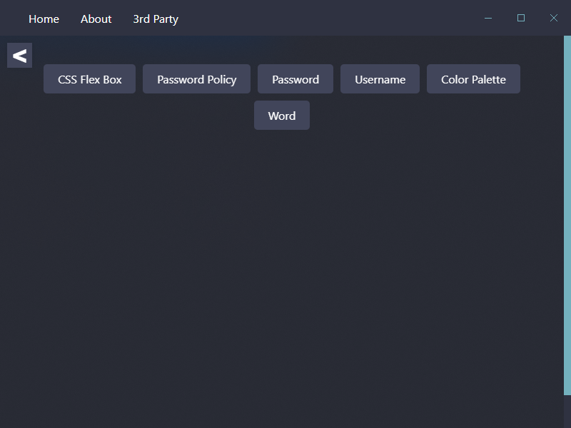
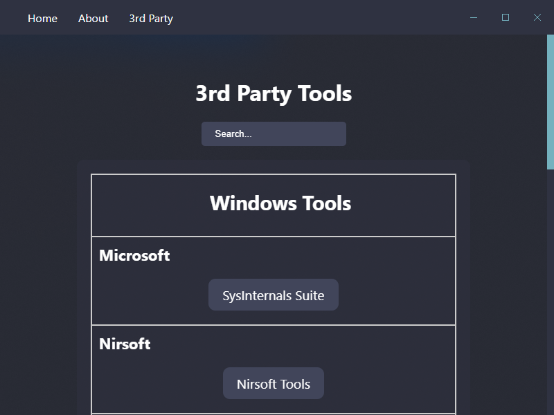

# Windows 10 Tools App

## Description

The Windows 10 Tools App is a collection of essential utilities and tools designed to enhance your Windows 10 experience. Whether you're a power user or a casual computer user, this app provides a set of features to simplify tasks, improve productivity, and optimize your system.

## Features

- **Feature 1:** A brief description of the first major feature of your app.
- **Feature 2:** A brief description of the second major feature of your app.
- **Feature 3:** A brief description of the third major feature of your app.
- **Feature 4:** A brief description of the fourth major feature of your app.

## Screenshots

## Installation

To use the Windows 10 Tools App, follow these steps:

1. [Download the latest release](https://github.com/MysticalMike60t/Tools-App/releases/latest).
2. Run the installer and follow the installation instructions.

## Usage

After installation, launch the app and explore its features:

- Feature 1: Describe how to use the first feature.
- Feature 2: Provide instructions for the second feature.
- Feature 3: Explain how to make the most of the third feature.
- Feature 4: Walk users through the fourth feature.

## System Requirements

- Windows 10

## Contributing

We welcome contributions from the community. If you'd like to contribute to this project, please follow these steps:

1. Fork the repository.
2. Create a new branch for your feature or bug fix.
3. Make your changes and commit them.
4. Submit a pull request with a clear description of your changes.

## License

This project is licensed under the [Apache-2.0 License](LICENSE) - see the [LICENSE](LICENSE) file for details.

## Contact

If you have any questions or need assistance, feel free to contact us at your@email.com.

---

Thank you for using the Windows 10 Tools App! We hope it simplifies your Windows 10 experience and enhances your productivity.

[Download Now](https://github.com/MysticalMike60t/Tools-App/releases/latest/download/Tools.Hub.Setup.1.0.6.exe)
